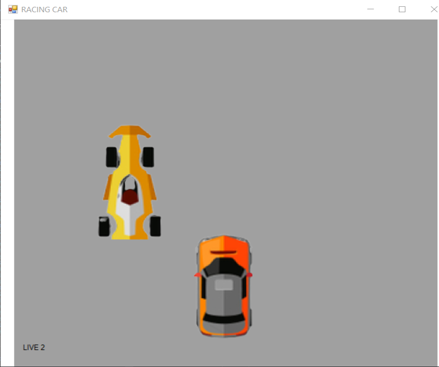
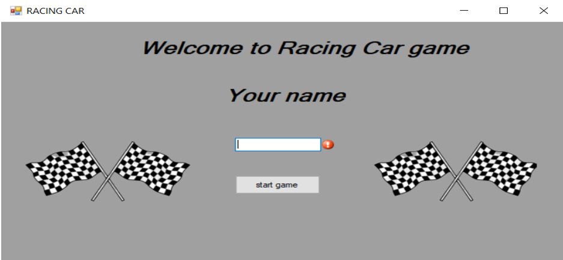
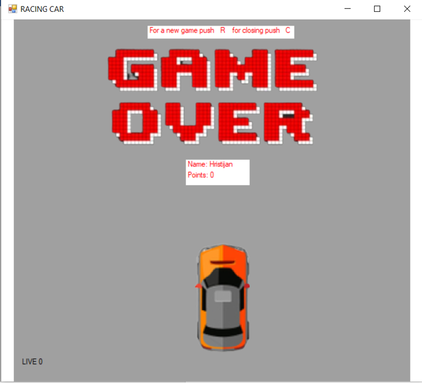

# Racin car game

## Вовед
Racin car е игра која ја имам развиено за целите на курсот визуелно програмирање. Играта е копиjа од старите системи за видео игри односно од аркадните машини кои беа популарни во 90 години. Racin car е игра која  симулира  трка на автомобили, чија цел на играчот е да ги престигне сите автомобили со цел прв да стаса до целта, но со ограничување при престигнувањето да не се случи судир помеѓу автомобилот кој е управуван од страна на играчот и а автомобилите кои се на стазата.

## Начин на имплементација
Играта е имплементирана со помош  на повеќе класи кои  претставуват PictureBox на дадената форма кои се додават динамички после внесување на името кое е задолжително и притискање на старт копчето. Од класата Cars произлегуват автомобилите кои со рандом локација се поставуват на на формата симулирајќи ги автомобилите кои треба да се престигнат. Во класата Cars постои метод Move() со чија помош  објектите се придвижуваат за +10 единици на Y оската.  Објектите од класата Cars се чуват во листа во класата Scena. Со помошна  на тајмер на секои 4s објектот од класата  Cars се креира и се додава во листата во објект од класата Scena. Со помош на уште еден тајмер на секои 100ms се изминуваат сите објекти од листата на класата Scena  и се повикува методата Move() со што се поместуват автомобилите и го симулира нивното движење. Од класата Car1 произлегува автомобилот кој е управуван од страна на корисникот, тој со креирање  се поставува на средина и со помое на Move() методот и  евентот KeyDown се овозможува движене по X оската, но не и излегување од границите на формата. Дополнително во формата се проверува дали е настанот судир помеѓу корисничкиот автомобил и некој останат автомобил, со тоа што ако има судир или ако има успешно престигнување на автомобил се абдејтира објект од класата player.
## Упатство за играње
По стартување на играта се прикажува почетниот прозорец на кој има поле за внес на името на играчот кое е задолжително и копче кое со клик на него ја стартува играта.

По стартување на играта  после четири секунди почнуваат да се додават автомобил на патеката. Во долниот лев агол се прикажани бројот на животи кои при старт на играта се инициализирани на 3, но  по судир се одзема по еден живот. Корисничкиот автомобил се движи лево десно соодветно со притискање на стрелките за лево или десно од тастатурата. Со губење на сите животи играта запита, со притискање на буквата R се отвара нова игра а со притискање на буквата C  играта се исклучува.

